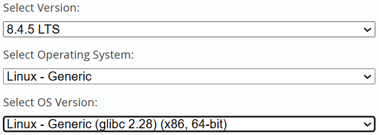

> [!NOTE]内容简介
> 记录一次安装 MySQL 8.0 过程  


> [!TIP]
> 本文使用环境：
>
> - 服务器：Kylin Linux Advanced Server V10 (Lance)  SP3-X86
> - MySQL：mysql-8.4.5-linux-glibc2.28-x86_64.tar.xz

<!--more-->

# 下载

==MySQL下载地址==[info] [MySQL :: Download MySQL Community Server](https://dev.mysql.com/downloads/mysql/)  



本文使用的 Kylin 在 `Select Operating System` 中没有，所以选了 `Linux - Generic`

==Linux glibc 查看==[primary] `ldd --version` 即可看见相应的版本号

==架构查看==[secondary] `uname -m`

剩下下载的包都没啥区别，只是大小不一样，别下带 `test` 的就行

# 检查

> [!WARNING]
> 正常是要在安装前检查原服务器是否已经有MySQL环境，有的话需要先卸载(不是直接删除)  
>
> 由于我也没卸载过，卸载MySQL就交给后面再出一篇吧


# 安装

> 这里要上传服务器的话，一般的 ssh 工具直接拖拽就好了；如果不能拖拽就试试 rz 命令
>
> - [?] 上传失败可能是你当前的用户没有权限传文件到当前的目录

接下来直接上代码(我上传的位置是`/opt`)

```sh
tar -xvf /opt/ mysql-8.4.5-linux-glibc2.28-x86_64.tar.xz
mv mysql-8.4.5-linux-glibc2.28-x86_64 mysql-8.4.5
```

mysqld --validate-config
