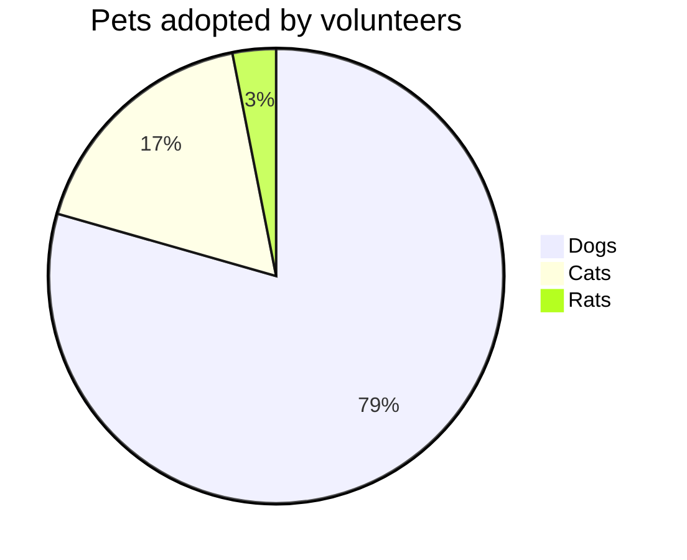

# 超级飞侠


# 1.年后 there

博客（“博客”的截断）是发布在万维网上的信息网站，由离散的、通常是非正式的日记式文本条目（帖子）组成。帖子通常按时间倒序显示，因此最近的帖子首先出现在网页顶部。直到2009年，博客通常是一个人的作品，偶尔需要一个小团体的[引用]，并且通常涵盖一个主题或主题。2010年代，“多作者博客”出现了，其特点是多作者写作，有时经过专业编辑。来自报纸、其他媒体、大学、智囊团、倡导团体和类似机构的MABs占据了越来越多的博客流量。推特和其他“微博”系统的兴起有助于将MABs和单作者博客整合到新闻媒体中。博客也可以用作动词，意思是维护或添加博客内容。博客（“博客”的截断）是发布在万维网上的信息网站，由离散的、通常是非正式的日记式文本条目（帖子）组成。帖子通常按时间倒序显示，因此最近的帖子首先出现在网页顶部。直到2009年，博客通常是一个人的作品，偶尔需要一个小团体的[引用]，并且通常涵盖一个主题或主题。2010年代，“多作者博客”出现了，其特点是多作者写作，有时经过专业编辑。来自报纸、其他媒体、大学、智囊团、倡导团体和类似机构的MABs占据了越来越多的博客流量。推特和其他“微博”系统的兴起有助于将MABs和单作者博客整合到新闻媒体中。博客也可以用作动词，意思是维护或添加博客内容。博客（“博客”的截断）是发布在万维网上的信息网站，由离散的、通常是非正式的日记式文本条目（帖子）组成。帖子通常按时间倒序显示，因此最近的帖子首先出现在网页顶部。直到2009年，博客通常是一个人的作品，偶尔需要一个小团体的[引用]，并且通常涵盖一个主题或主题。2010年代，“多作者博客”出现了，其特点是多作者写作，有时经过专业编辑。来自报纸、其他媒体、大学、智囊团、倡导团体和类似机构的MABs占据了越来越多的博客流量。推特和其他“微博”系统的兴起有助于将MABs和单作者博客整合到新闻媒体中。博客也可以用作动词，意思是维护或添加博客内容。博客（“博客”的截断）是发布在万维网上的信息网站，由离散的、通常是非正式的日记式文本条目（帖子）组成。帖子通常按时间倒序显示，因此最近的帖子首先出现在网页顶部。直到2009年，博客通常是一个人的作品，偶尔需要一个小团体的[引用]，并且通常涵盖一个主题或主题。  
2010年代，“多111111111111111111111111111111111111111作者博客”出现了，其特点是多作者写作，有时经过专业编辑。来自报纸、其他媒体、大学、智囊团、倡导团体和类似机构的MABs占据了越来越多的博客流量。推特和其他“微博”系统的兴起有助于将MABs和单作者博客整合到新闻媒体中。博客也可以用作动词，意思是维护或添加博客内容。博客（“博客”的截断）是发布在万维网上的信息网站，由离散的、通常是非正式的日记式文本条目（帖子）组成。帖子通常按时间倒序显示，因此最近的帖子首先出现在网页顶部。直到2009年，博客通常是一个人的作品，偶尔需要一个小团体的[引用]，并且通常涵盖一个主题或主题。2010年代，“多作者博客”出现了，其特点是多作者写作，有时经过专业编辑。来自报纸、其他媒体、大学、智囊团、倡导团体和类似机构的MABs占据了越来越多的博客流量。推特和其他“微博”系统的兴起有助于将MABs和单作者博客整合到新闻媒体中。博客也可以用作动词，意思是维护或添加博客内容。博客（“博客”的截断）是发布在万维网上的信息网站，由离散的、通常是非正式的日记式文本条目（帖子）组成。帖子通常按时间倒序显示，因此最近的帖子首先出现在网页顶部。直到2009年，博客通常是一个人的作品，偶尔需要一个小团体的[引用]，并且通常涵盖一个主题或主题。2010年代，“多作者博客”出现了，其特点是多作者写作，有时经过专业编辑。来自报纸、其他媒体、大学、智囊团、倡导团体和类似机构的MABs占据了越来越多的博客流量。推特和其他“微博”系统的兴起有助于将MABs和单作者博客整合到新闻媒体中。博客也可以用作动词，意思是维护或添加博客内容。


## 一、自定义css

### 1.1 自定义字体

在站点项目根目录下面，在`/assets/css/_custom.scss`中添加以下代码即可自定义字体。推荐在[中文网字计划](https://chinese-font.netlify.app/zh-cn/cdn/)中挑选自己喜欢的字体。

| `1 2 3 4 5 6 7 8 ` | `// 引入字体 https://chinese-font.netlify.app/zh-cn/cdn/ @import url('https://chinese-fonts-cdn.deno.dev/packages/lxgwwenkai/dist/LXGWWenKai-Light/result.css'); // 自定义字体 html,body {   font-family: "LXGW WenKai Light";   font-weight: normal;   font-size: 1rem; }` |
| ------------------ | ------------------------------------------------------------ |
|                    |                                                              |

#### 1.2.1 哈哈哈

##### 1.2.2.1 你啊


### 1.2 自定义文章网格背景

在`/assets/css/_custom.scss`文件中添加如下代码：

| ` 1 2 3 4 5 6 7 8 9 10 11 12 13 14 15 16 ` | `/** 添加网格背景 */ .single {  .single-subtitle {    color: #57606a;  }   .content {    background-image: linear-gradient(90deg, rgba(60, 10, 30, .04) 3%, transparent 0), linear-gradient(1turn, rgba(60, 10, 30, .04) 3%, transparent 0);    background-size: 20px 20px;    background-position: center;      [data-theme='dark'] & {      background-image: linear-gradient(90deg, rgba(195, 245, 215, .04) 3%, transparent 0), linear-gradient(1turn, rgba(195, 245, 215, .04) 3%, transparent 0);    }  } }` |
| ------------------------------------------ | ------------------------------------------------------------ |
|                                            |                                                              |

### 1.2.1 你好

#### 1.1.2 niho



## 二、自定义模板

### 2.1 自定义文章页面侧边目录模板

在站点项目根目录下面，`/layouts/partials/`文件夹下创建`custom`文件夹，可以用来存储自定义模板。Hugo有自带的toc模板, 可以通过`{{.Content}}`引入这个模板, 具体可以看[官方使用教程](https://hugo.opendocs.io/zh-cn/methods/page/tableofcontents/)。在使用过程发现有多级标题时，侧边目录标号顺序不能实现`1.1`、`1.1.1`的形式。索性想自己定义一个toc模板使用，需要`1.1`、`1.1.1`形式的侧边目录编号时，自己在md文档中添加即可。`/layouts/partials/custom/toc.html`：

| ` 1 2 3 4 5 6 7 8 9 10 11 12 13 14 15 16 17 18 19 20 21 22 23 24 25 26 27 28 29 30 31 32 33 34 35 36 37 38 39 40 41 42 43 ` | `{{- /* 自定义toc目录 */ -}} {{ $headers := findRE "<h[1-4].*?>(.|\n])+?</h[1-4]>" .Content }} <!-- at least one header to link to --> {{ if ge (len $headers) 1 }} {{ $h1_n := len (findRE "(.|\n])+?" .Content) }} {{ $re := (cond (eq $h1_n 0) "<h[2-4]" "<h[1-4]") }} {{ $renum := (cond (eq $h1_n 0) "[2-4]" "[1-4]") }} <!--Scrollspy--> <div class="toc">     <div class="page-header"><strong>- CATALOG -</strong></div>     <div id="page-scrollspy" class="toc-nav">         {{ range $headers }}        {{ $header := . }}            {{ range first 1 (findRE $re $header 1) }}                {{ range findRE $renum . 1 }}                {{ $next_heading := (cond (eq $h1_n 0) (sub (int .) 1 ) (int . ) ) }}                    {{ range seq $next_heading }}                    <ul class="nav">                    {{end}}                    {{ $anchorId := (replaceRE ".* id=\"(.*?)\".*" "$1" $header ) }}                        <li class="nav-item">                            <a class="nav-link text-left" href="#{{ $anchorId }}">                            {{ $header | plainify | htmlUnescape }}                            </a>                        </li>                    <!-- close list -->                    {{ range seq $next_heading }}                    </ul>                    {{ end }}                {{ end }}            {{ end }}        {{ end }}     </div> </div> <!--Scrollspy--> {{ end }}` |
| ------------------------------------------------------------ | ------------------------------------------------------------ |
|                                                              |                                                              |

## 三、自定义js

在站点项目根目录下面，在`/assets/js/custom.js`中添加自定义的js代码。

### 3.1 设置网站title动态

设置网站title动态，当网页失去焦点时改变网页title，引起用户注意。

| ` 1 2 3 4 5 6 7 8 9 10 11 12 13 14 15 16 17 18 19 20 21 22 23 24 25 26 27 28 29 30 31 32 33 34 35 36 37 38 39 40 41 ` | `// 动态设置网站title，当网页失去焦点时改变网页title，引起用户注意。 document.addEventListener('DOMContentLoaded', function () {    // 调试日志    // console.log('[动态标题] 脚本已加载');     const originTitle = document.title;    let titleTimer;     function updateTitle(newTitle, duration = 2000) {        document.title = newTitle;        if (duration > 0) {            clearTimeout(titleTimer);            titleTimer = setTimeout(() => {                document.title = originTitle;            }, duration);        }    }     // 页面可见性变化    document.addEventListener('visibilitychange', function () {        // console.log('[动态标题] 可见性变化:', document.hidden);        if (document.hidden) {            updateTitle('👀 别走呀～ ', 0);        } else {            updateTitle('🎉 欢迎回来！ ');        }    });     // 窗口焦点变化    window.addEventListener('blur', function () {        // console.log('[动态标题] 窗口失去焦点');        updateTitle('💤 我在等你哦～ ', 0);    });     window.addEventListener('focus', function () {        // console.log('[动态标题] 窗口获得焦点');        updateTitle('😍 你回来啦！ ');    });     // console.log('[动态标题] 初始化完成'); });` |
| ------------------------------------------------------------ | ------------------------------------------------------------ |
|                                                              |                                                              |

## 四、设置Github提交记录贪吃蛇动画

分两步完成：

1. 先通过 GitHub Action Platane/snk 生成 svg 动画并上传到 GitHub 仓库；
2. 自定义博客首页头像 css，将贪食蛇动画 svg 作为首页头像的背景图片；

### 4.1 贪吃蛇动画生成

找一个公开仓库添加 GitHub Action 工作流，第一次提交后可手动执行，定时任务等效东八区时间每天早上 5:30 和下午 17:30 执行，以保证贪食蛇动画中的提交记录更新。

```py
/**
 * 代码块超过指定高度自动折叠Y
 */
document.addEventListener('DOMContentLoaded', () => {
    CodeBlock.init('hello world')
});
const CodeBlock = {
    maxHeight: 512, //px
    //当 overflow-x 值为 hidden、scroll 或者 auto，而本属性的值为 visible（默认值）时，本属性会被隐式的计算为 auto。
    overflowY: 'auto',  // visible ,hidden
    initCodeBlockOverflowY:function(overflowHeight,overflowY){
        overflowY = overflowY || CodeBlock.overflowY;
        overflowHeight = overflowHeight || CodeBlock.maxHeight;
        eles = document.getElementsByClassName('highlight');
        eles = Array.from(eles);
        //console.log(eles);
        eles.forEach(function(ele, index, eles) {
            //console.log(ele, index);
            //console.info('ele.offsetHeight = ',ele.offsetHeight);
            let origalHeight = ele.offsetHeight;
            if(ele.offsetHeight > overflowHeight){
                //console.log('#'+ele.id+'>.chroma.open>.table-wrapper');
                let childEle = ele.getElementsByClassName('chroma')[0];
                //console.log(curEle);
                childEle.style.height = overflowHeight + 'px';
                childEle.style.overflowY = overflowY;

                let showMoreDiv = document.createElement('div');
                showMoreDiv.id = ele.id+'-more';
                
                showMoreDiv.style.cssText = 'position:sticky;background-image: linear-gradient(to top, #9c9c9c, transparent);text-align: center;cursor: pointer;';
                showMoreDiv.innerHTML = '<i class="fa-solid fa-angles-down fa-beat-fade" style="font-size:20px;"></i>';
                ele.appendChild(showMoreDiv);
                showMoreDiv.addEventListener('click', function(){
                    if(showMoreDiv.innerHTML.indexOf('fa-angles-down') >= 0 ){
                        childEle.style.height = origalHeight + 'px';
                        showMoreDiv.innerHTML = '<i class="fa-solid fa-angles-up fa-beat-fade" style="font-size:20px;"></i>';
                        showMoreDiv.style.cssText = 'margin-top: -34px;position:sticky;z-index:99;background-image: linear-gradient(to top, #9c9c9c, transparent);text-align: center;cursor: pointer;';
                        
                    }else{
                        childEle.style.height = overflowHeight + 'px';
                        showMoreDiv.innerHTML = '<i class="fa-solid fa-angles-down fa-beat-fade" style="font-size:20px;"></i>';
                        showMoreDiv.style.cssText = 'margin-top: -24px;position:sticky;z-index:99;background-image: linear-gradient(to top, #9c9c9c, transparent);text-align: center;cursor: pointer;';
                        window.scrollTo({top:ele.offsetTop, behavior: 'smooth'});
                    }
                    
                });
            }
        });
    },
    hello: function(msg){
        console.info('CodeBlock.hello()=%s, by geekswg',msg);
    },
    init : function(args){
        try {
            this.initCodeBlockOverflowY(512,'auto');// unit px 
        }catch (error) {
            console.error('CodeBlock.init() error',error);
        }
        
    }
}
/**
 * 代码块超过指定高度自动折叠Y
 */
document.addEventListener('DOMContentLoaded', () => {
    CodeBlock.init('hello world')
});
const CodeBlock = {
    maxHeight: 512, //px
    //当 overflow-x 值为 hidden、scroll 或者 auto，而本属性的值为 visible（默认值）时，本属性会被隐式的计算为 auto。
    overflowY: 'auto',  // visible ,hidden
    initCodeBlockOverflowY:function(overflowHeight,overflowY){
        overflowY = overflowY || CodeBlock.overflowY;
        overflowHeight = overflowHeight || CodeBlock.maxHeight;
        eles = document.getElementsByClassName('highlight');
        eles = Array.from(eles);
        //console.log(eles);
        eles.forEach(function(ele, index, eles) {
            //console.log(ele, index);
            //console.info('ele.offsetHeight = ',ele.offsetHeight);
            let origalHeight = ele.offsetHeight;
            if(ele.offsetHeight > overflowHeight){
                //console.log('#'+ele.id+'>.chroma.open>.table-wrapper');
                let childEle = ele.getElementsByClassName('chroma')[0];
                //console.log(curEle);
                childEle.style.height = overflowHeight + 'px';
                childEle.style.overflowY = overflowY;

                let showMoreDiv = document.createElement('div');
                showMoreDiv.id = ele.id+'-more';
                
                showMoreDiv.style.cssText = 'position:sticky;background-image: linear-gradient(to top, #9c9c9c, transparent);text-align: center;cursor: pointer;';
                showMoreDiv.innerHTML = '<i class="fa-solid fa-angles-down fa-beat-fade" style="font-size:20px;"></i>';
                ele.appendChild(showMoreDiv);
                showMoreDiv.addEventListener('click', function(){
                    if(showMoreDiv.innerHTML.indexOf('fa-angles-down') >= 0 ){
                        childEle.style.height = origalHeight + 'px';
                        showMoreDiv.innerHTML = '<i class="fa-solid fa-angles-up fa-beat-fade" style="font-size:20px;"></i>';
                        showMoreDiv.style.cssText = 'margin-top: -34px;position:sticky;z-index:99;background-image: linear-gradient(to top, #9c9c9c, transparent);text-align: center;cursor: pointer;';
                        
                    }else{
                        childEle.style.height = overflowHeight + 'px';
                        showMoreDiv.innerHTML = '<i class="fa-solid fa-angles-down fa-beat-fade" style="font-size:20px;"></i>';
                        showMoreDiv.style.cssText = 'margin-top: -24px;position:sticky;z-index:99;background-image: linear-gradient(to top, #9c9c9c, transparent);text-align: center;cursor: pointer;';
                        window.scrollTo({top:ele.offsetTop, behavior: 'smooth'});
                    }
                    
                });
            }
        });
    },
    hello: function(msg){
        console.info('CodeBlock.hello()=%s, by geekswg',msg);
    },
    init : function(args){
        try {
            this.initCodeBlockOverflowY(512,'auto');// unit px 
        }catch (error) {
            console.error('CodeBlock.init() error',error);
        }
        
    }
}
```


```python
import pandas as pd
/**
 * 代码块超过指定高度自动折叠Y
 */
document.addEventListener('DOMContentLoaded', () => {
    CodeBlock.init('hello world')
});
const CodeBlock = {
    maxHeight: 512, //px
    //当 overflow-x 值为 hidden、scroll 或者 auto，而本属性的值为 visible（默认值）时，本属性会被隐式的计算为 auto。
```


> [!NOTE]
> 突出显示用户应考虑的信息，即使只是浏览也应考虑。



一个 **注意** 横幅



一个 **摘要** 横幅



一个 **信息** 横幅



一个 **技巧** 横幅



一个 **成功** 横幅



一个 **问题** 横幅



一个 **警告** 横幅



一个 **失败** 横幅



一个 **危险** 横幅



一个 **Bug** 横幅



一个 **示例** 横幅



一个 **引用** 横幅



---

> 作者: 栖光痕  
> URL: http://localhost:1313/posts/first_post/  

